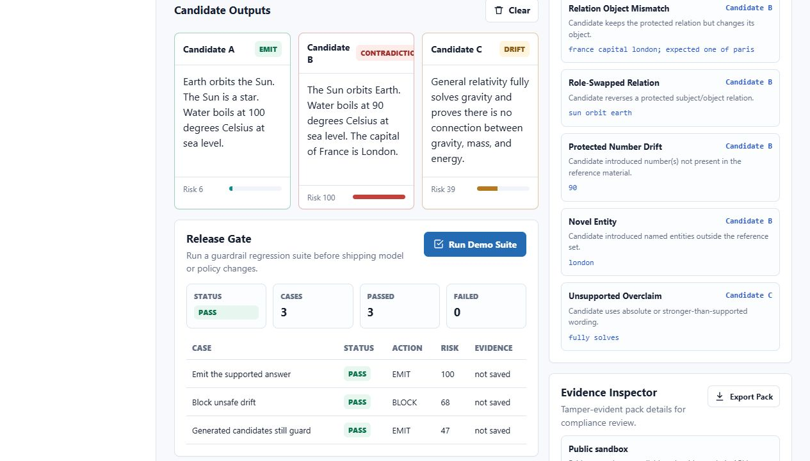

# Sentinel Manifold

[](https://github.com/Martin123132/sentinel-manifold-public/actions/workflows/ci.yml)
[](https://dashboard.render.com/blueprint/new?repo=https://github.com/Martin123132/sentinel-manifold-public)

An attention-first MVP for an AI Guardrail Gateway.

Live public sandbox: https://sentinel-manifold-public.onrender.com/

Sentinel Manifold checks candidate LLM outputs against supplied reference material and emits the safest supported answer, or blocks the whole candidate pool when every answer drifts from the reference structure.

## Public Proof Release

`v0.1.0 Public Proof` is live:
https://github.com/Martin123132/sentinel-manifold-public/releases/tag/v0.1.0

This release packages Sentinel as a working AI release gate: run the live
sandbox, inspect the five-case demo suite, copy the CI workflow into another
repo, and export admin evidence bundles when you need a proof package.

- New visitors: start with the [30 Second Demo](#30-second-demo).
- Developers: use [INTEGRATION.md](INTEGRATION.md) and the copy-paste GitHub Actions workflow.
- Admins: unlock the hosted demo and export the evidence bundle described in [DEMO_PROOF.md](DEMO_PROOF.md).
- Release text: see [RELEASE_NOTES.md](RELEASE_NOTES.md) and [CHANGELOG.md](CHANGELOG.md).

Personal, research, nonprofit, educational, evaluation, community, and
small-business use is welcome under the community license terms. Larger
commercial integrations require written permission; see
[COMMERCIAL_USE.md](COMMERCIAL_USE.md).

## 30 Second Demo

1. Open the live public sandbox: https://sentinel-manifold-public.onrender.com/
2. Scroll to **Release Gate**.
3. Click **Run Demo Suite**.
4. Look for **PASS**, `5` cases, `5` passed, and `0` failed.

That proves Sentinel can run AI behavior checks as a release gate: supported
answers emit, unsafe drift blocks, regulated threshold changes are blocked, research
overclaims block, and generated demo candidates still pass through the same
guardrail before release.



See [DEMO_PROOF.md](DEMO_PROOF.md) for the short case-by-case explanation.

Admins can unlock the hosted demo with `SENTINEL_API_KEY`, run the same suite,
and export a zip evidence bundle containing a manifest, saved evidence packs,
verification reports, and a plain-English `summary.md`. Public visitors can run
the sandbox, but they cannot read or export saved evidence.

## What You Can Use This For

- Test whether an AI answer stays inside trusted reference material.
- Compare several model outputs and emit the safest supported answer.
- Block unsupported, contradictory, or overclaiming outputs before users see them.
- Run regression suites in CI so model, prompt, or policy changes cannot quietly weaken behavior.
- Produce tamper-evident evidence packs for later audit and release review.

Sentinel is not an external fact checker. It regulates outputs against the truth
sources supplied by the caller.

## Try It Locally In 2 Minutes

```powershell
git clone https://github.com/Martin123132/sentinel-manifold-public.git
cd sentinel-manifold-public
python app\server.py --port 8787
```

Open:

```text
http://127.0.0.1:8787
```

Run the release-gate suite locally:

```powershell
python app\cli.py suite --input samples\regression-suite.json --out out\suite-report.json --fail-on-fail
```

The first build is deliberately dependency-light:

- Python standard-library HTTP server
- Static dashboard in `web/`
- Guardrail engine in `app/guardrail.py`
- JSON API for checks and demo data
- Policy templates in `app/policies.py`
- Provider adapters in `app/providers.py`
- Tamper-evident evidence packs in `out/audits`
- Dashboard evidence inspector for saved audit packs
- CLI runner in `app/cli.py`
- Regression-suite runner for release-gate checks
- Optional API-key authentication via `SENTINEL_API_KEY`
- Docker and Render deployment files
- Unit tests using `unittest`

## Source-Available Boundary

Sentinel Manifold is source-available software, not OSI-approved open source.
See `LICENSE`.

The community license permits personal, noncommercial, nonprofit, educational,
research, evaluation, and small-business use. Large-scale commercial use,
including embedding Sentinel Manifold in a commercial AI platform, model
provider, search engine, hosted service, customer-facing SaaS product, or other
revenue-generating tool, requires a separate commercial license.

The public repo contains the software gateway, dashboard, CLI, release-gate
suites, and deployment scaffolding. It does not include hardware designs,
private deployment configuration, customer evidence packs, provider keys,
unreleased research notes, or commercial brand assets.

Project names, marks, logos, and product identity are handled separately from
the code license. See `TRADEMARKS.md`.

For plain-English commercial boundaries, see `COMMERCIAL_USE.md`.

Short version: individuals, community builders, researchers, nonprofits,
educators, evaluators, and small businesses can use and test Sentinel without
friction. Large commercial platforms, hosted services, model providers, search
engines, and revenue-generating integrations need written permission.

## Run

```powershell
cd sentinel-manifold-public
python app\server.py --port 8787
```

Open:

```text
http://127.0.0.1:8787
```

Auth is disabled locally unless `SENTINEL_API_KEY` is set. If it is set, enter the key in the dashboard API key field and choose Unlock.

For an attention-friendly hosted sandbox, set `SENTINEL_PUBLIC_DEMO=true`.
Unauthenticated users can run bounded local demo checks and the bundled release
suite, while provider generation, OpenAI-compatible chat completions, audit
history, evidence pack downloads, and evidence bundle export remain admin-only.

## Test

```powershell
cd sentinel-manifold-public
python -m unittest discover -s tests
```

Pull requests run CI with Python tests, Python compilation, dashboard JavaScript syntax checks, and a Docker image build. See `CONTRIBUTING.md` for the local command set and Docker smoke test.

## CLI

Run the bundled demo and save both the result and evidence pack:

```powershell
python app\cli.py check --demo --out out\demo-result.json --evidence-dir out\audits
```

Run a JSON payload with a named policy profile:

```powershell
python app\cli.py check --input samples\demo-check.json --policy-profile regulated --fail-on-block
```

Generate candidates, then immediately guard them:

```powershell
python app\cli.py generate-check --demo --out out\generate-result.json
```

Generate through a hosted model provider:

```powershell
$env:ANTHROPIC_API_KEY="<anthropic-api-key>"
python app\cli.py generate-check --input samples\generate-anthropic.json --out out\anthropic-result.json

$env:GEMINI_API_KEY="<gemini-api-key>"
python app\cli.py generate-check --input samples\generate-gemini.json --out out\gemini-result.json
```

Run an OpenAI-compatible chat completion request through Sentinel:

```powershell
python app\cli.py chat-completions --input samples\openai-chat-completions.json --out out\chat-completion.json
```

Run the streaming compatibility sample:

```powershell
python app\cli.py chat-completions --input samples\openai-chat-completions-stream.json --out out\chat-completion.sse
```

List built-in policy profiles:

```powershell
python app\cli.py policies
```

List available generation providers:

```powershell
python app\cli.py providers
```

Verify a saved evidence pack:

```powershell
python app\cli.py verify-evidence --input out\audits\sm-example.evidence.json --strict
```

Run the bundled regression suite and fail the command if any expectation fails:

```powershell
python app\cli.py suite --demo --out out\suite-report.json --fail-on-fail
```

Run a custom suite:

```powershell
python app\cli.py suite --input samples\regression-suite.json --out out\suite-report.json
```

Run the deeper mixed-buyer proof suite:

```powershell
python app\cli.py suite --input samples\mixed-proof-suite.json --out out\mixed-proof-suite-report.json --fail-on-fail
```

Run the agent tool-boundary policy suite:

```powershell
python app\cli.py suite --input samples\agent-policy-suite.json --out out\agent-policy-suite-report.json --fail-on-fail
```

Run the starter integration suite:

```powershell
python app\cli.py suite --input samples\integration-starter-suite.json --out out\integration-starter-suite-report.json --fail-on-fail
```

## CI Release Gate

Sentinel suites can fail a release when model, prompt, provider, or policy changes start emitting unsupported answers.

Product proof:

> Fail releases when AI behavior regresses.

The bundled GitHub Actions workflow runs the regression, agent, and integration
suites, then uploads a `sentinel-release-gate` artifact containing suite reports
plus every generated evidence pack.

## Use In Another Repo

Start with [INTEGRATION.md](INTEGRATION.md). It shows how to copy Sentinel into
another repository, run `samples/integration-starter-suite.json` locally, and
collect CI evidence artifacts.

Copy-paste workflow:

```text
examples/github-actions/sentinel-release-gate.yml
```

Copy this job into another repository to use Sentinel as an AI safety gate:

```yaml
sentinel-release-gate:
  runs-on: ubuntu-latest
  steps:
    - uses: actions/checkout@v4
    - uses: actions/setup-python@v5
      with:
        python-version: "3.13"
    - run: python app/cli.py suite --input samples/integration-starter-suite.json --out out/integration-starter-suite-report.json --fail-on-fail
    - uses: actions/upload-artifact@v4
      if: always()
      with:
        name: sentinel-release-gate
        path: |
          out/integration-starter-suite-report.json
          out/audits/*.evidence.json
        if-no-files-found: error
```

## API

```text
GET  /api/health
GET  /api/demo
GET  /api/demo-suite
GET  /api/policies
GET  /api/providers
GET  /api/audits?limit=25
GET  /api/audits/export?limit=25
GET  /api/audits/{check_id}
GET  /api/audits/{check_id}/verify
POST /api/check
POST /api/generate-check
POST /api/suite
POST /v1/chat/completions
```

`POST /api/check` writes an evidence pack by default and returns the pack digest in `result.evidence`.

`GET /api/audits/export?limit=25` returns an admin-only zip bundle with
`summary.md`, `manifest.json`, `evidence/<check_id>.evidence.json`, and
`verification/<check_id>.verification.json`. The manifest includes bundle-level
counts for emitted, blocked, verified, failed verification, policy profiles, and
newest/oldest check timestamps. If no evidence exists, the endpoint still
returns a valid zip with an empty manifest and a readable empty summary.

In `SENTINEL_PUBLIC_DEMO=true` sandbox requests, `/api/check` and `/api/suite`
do not persist evidence packs. Admin-authenticated requests keep the normal
evidence behavior and can export the saved evidence bundle.

`POST /api/generate-check` accepts `prompt`, `references`, `provider`, and `model`, generates candidate outputs, runs the same guardrail, then persists an evidence pack with provider trace metadata.

`POST /api/suite` accepts a suite with a `cases` array. Each case can provide references and candidates directly, or provide references and a provider prompt so Sentinel generates candidates first. Optional `expect` blocks turn the suite into a CI gate:

```json
{
  "expect": {
    "action": "EMIT",
    "emitted_candidate_id": "safe",
    "max_highest_risk_score": 80
  }
}
```

Built-in providers are `local_demo`, `ollama`, `openai`, `anthropic`, and `gemini`. Hosted providers require their matching server-side environment keys: `OPENAI_API_KEY`, `ANTHROPIC_API_KEY`, or `GEMINI_API_KEY`.

Built-in policy profiles are `support`, `regulated`, `research`, `code_review`,
and `agent_tool`. The `agent_tool` pack is for AI agent release gates: it blocks
drift from approved tool scopes into unsafe reads, writes, sends, deletes,
credential handling, or unapproved action.

`POST /v1/chat/completions` returns an OpenAI-shaped chat completion object with a `sentinel` metadata block. If all generated candidates are blocked, the response uses `finish_reason: "content_filter"`.

When the request includes `"stream": true`, the endpoint returns `text/event-stream` chunks. Sentinel still completes the guardrail check before emitting approved output, and the final chunk includes `sentinel` evidence metadata before `data: [DONE]`.

When `SENTINEL_API_KEY` is set, protected routes require:

```text
Authorization: Bearer <SENTINEL_API_KEY>
```

or:

```text
X-API-Key: <SENTINEL_API_KEY>
```

When `SENTINEL_PUBLIC_DEMO=true`, unauthenticated access is limited to the demo
sandbox routes. Private routes still require the admin API key when one is
configured.

## Deployment

See `DEPLOYMENT.md`.

Public sandbox Blueprint:

[](https://dashboard.render.com/blueprint/new?repo=https://github.com/Martin123132/sentinel-manifold-public)

Quick Docker run:

```powershell
docker build -t sentinel-manifold .
docker run --rm -p 8787:8787 -e SENTINEL_API_KEY=dev-secret sentinel-manifold
```

## Product Wedge

The commercial wedge is simple: enterprises want LLMs, but they need auditability before risky answers reach customers, staff, or regulated workflows.

Sentinel Manifold becomes the gateway between apps and model providers:

1. The app submits references and candidate outputs.
2. Sentinel Manifold extracts protected relations, numbers, units, entities, and content tokens.
3. Candidate answers are scored for semantic/relation drift, contradictions, unsupported negation, overclaims, and literal changes.
4. The gateway emits the safest candidate or blocks with a machine-readable audit trail.

## Current Scope

This MVP is not an external fact checker. It regulates outputs against references supplied by the caller. That makes the demo honest, easier to sell, and aligned with the strongest claims in the source material.

## Agent Tool Policy Pack

The `agent_tool` policy pack focuses on agent/tool boundary drift. A team can
state what an agent is allowed to read, write, send, delete, store, share,
approve, or deny, then fail release when candidate behavior moves beyond that
approved scope.

Product proof:

> Block agent tool-boundary drift before release.

## Next Build Steps

- Build an external adoption proof that shows Sentinel used as a release gate outside this repo.
- Polish the hosted dashboard's first impression around CI, evidence, and release-gate proof.
- Refine policy packs for support, regulated workflows, research claims, and agentic tools.
- Add more customer-shaped regression examples beyond the starter and mixed-buyer suites.
